# IAST - Interactive Automated Streamlined Terminal

A web-based TN3270 terminal emulator with automation capabilities for IBM mainframe systems. Features real-time terminal emulation, Azure Entra ID authentication, and Automated Streamlined Transactions (ASTs).

## Architecture Overview

```mermaid
flowchart LR
    Browser["🌐 Browser<br>(React)"] <-->|WSS| API["⚡ API Server<br>(Fastify)"]
    API <-->|WS| Gateway["🐍 Gateway<br>(Python)"]
    Gateway <-->|TN3270| Mainframe["🖥️ Mainframe"]
    
    API --> DynamoDB["🗄️ DynamoDB"]
    Gateway --> DynamoDB
```



**Key Points:**

- **WebSocket Bridge**: API server bridges browser ↔ gateway WebSocket connections
- **Direct TN3270**: Gateway maintains actual TN3270 connections to mainframe
- **Stateless API**: All state lives in Gateway (TN3270) and DynamoDB (persistence)

See [docs/ARCHITECTURE.md](docs/ARCHITECTURE.md) for detailed architecture documentation.

---

## Quick Start

```bash
# Prerequisites
node --version   # >= 24.0.0
pnpm --version   # >= 10.0.0
python --version # >= 3.12
uv --version     # any recent version
docker --version # for local DynamoDB

# Clone and install
git clone <repo>
cd iast

pnpm install                    # TypeScript packages
cd gateway && uv sync && cd ..  # Python gateway

# Configure environment
cp apps/api/.env.example apps/api/.env
cp apps/web/.env.example apps/web/.env
cp gateway/.env.example gateway/.env

# Start everything
pnpm dev
```

**Services:**

| Service | URL | Description |
|---------|-----|-------------|
| Web | <http://localhost:5173> | React frontend |
| API | <http://localhost:3000> | Fastify API + WebSocket bridge |
| Gateway | ws://localhost:8765 | TN3270 gateway |
| DynamoDB | <http://localhost:8042> | Local database |

---

## Prerequisites

| Tool | Version | Installation |
|------|---------|--------------|
| **Node.js** | >= 24.0.0 | [nodejs.org](https://nodejs.org) or `nvm install 24` |
| **pnpm** | >= 10.0.0 | `corepack enable && corepack prepare pnpm@latest --activate` |
| **Python** | >= 3.12 | [python.org](https://python.org) or `pyenv install 3.12` |
| **uv** | latest | `curl -LsSf https://astral.sh/uv/install.sh \| sh` |
| **Docker** | latest | [docker.com](https://docker.com) |

**Optional:**

- **Hercules**: Local mainframe emulator for testing
- **VPN**: Access to real mainframe systems

---

## Environment Configuration

### API Server (`apps/api/.env`)

```env
PORT=3000
HOST=0.0.0.0
LOG_LEVEL=info

# DynamoDB
DYNAMODB_ENDPOINT=http://localhost:8042
DYNAMODB_REGION=us-east-1
DYNAMODB_TABLE_NAME=terminal
DYNAMODB_ACCESS_KEY_ID=dummy
DYNAMODB_SECRET_ACCESS_KEY=dummy

# Gateway connection
GATEWAY_WS_URL=ws://localhost:8765

# Azure Entra ID
ENTRA_TENANT_ID=your-tenant-id
ENTRA_CLIENT_ID=your-api-client-id
ENTRA_AUDIENCE=api://your-api-client-id

# Credential Encryption (required for scheduled ASTs)
# Generate: node -e "console.log(require('crypto').randomBytes(32).toString('hex'))"
CREDENTIALS_ENCRYPTION_KEY=your-64-char-hex-key

# EventBridge Scheduler (optional - AWS deployment only)
# SCHEDULER_LAMBDA_ARN=arn:aws:lambda:region:account:function:ast-scheduler
# SCHEDULER_ROLE_ARN=arn:aws:iam::account:role/EventBridgeSchedulerRole
```

### Web Frontend (`apps/web/.env`)

```env
VITE_API_URL=http://localhost:3000
VITE_WS_URL=ws://localhost:3000

# Azure Entra ID (SPA)
VITE_ENTRA_CLIENT_ID=your-spa-client-id
VITE_ENTRA_TENANT_ID=your-tenant-id
VITE_ENTRA_REDIRECT_URI=http://localhost:5173
VITE_ENTRA_API_SCOPE=api://your-api-client-id/.default
```

### Gateway (`gateway/.env`)

```env
HOST=0.0.0.0
PORT=8765

# TN3270 Mainframe
TN3270_HOST=mainframe.example.com
TN3270_PORT=23
TN3270_MAX_SESSIONS=10

# DynamoDB
DYNAMODB_ENDPOINT=http://localhost:8042
DYNAMODB_REGION=us-east-1
DYNAMODB_TABLE_NAME=terminal
DYNAMODB_ACCESS_KEY_ID=dummy
DYNAMODB_SECRET_ACCESS_KEY=dummy
```

---

## Development Commands

### Running Services

```bash
pnpm dev              # Start all services + DynamoDB
pnpm app              # Start services only (DynamoDB must be running)
pnpm dev:web          # React frontend only
pnpm dev:api          # API server only
pnpm dev:gateway      # Python gateway only
pnpm dev:db           # Start DynamoDB container
pnpm dev:db:stop      # Stop DynamoDB container
```

### Code Quality

```bash
pnpm typecheck        # TypeScript type checking
pnpm lint             # ESLint
pnpm format           # Prettier formatting
pnpm build            # Build all packages
pnpm clean            # Clean build artifacts
```

### Gateway (Python)

```bash
pnpm test:gateway     # Run pytest tests
pnpm coverage:gateway # Tests with coverage
cd gateway && uv run gateway-format  # Format Python
```

### Workspace Commands

```bash
# Add dependency to specific package
pnpm --filter @terminal/api add <package>
pnpm --filter @terminal/web add -D <package>

# Run command in specific package
pnpm --filter @terminal/api <script>
```

---

## Project Structure

```
/
├── apps/
│   ├── api/                 # Fastify API server
│   │   └── src/
│   │       ├── ws/          # WebSocket bridge
│   │       ├── routes/      # REST endpoints
│   │       └── services/    # Business logic
│   │
│   └── web/                 # React frontend
│       └── src/
│           ├── components/  # UI components
│           ├── hooks/       # React hooks
│           ├── stores/      # Zustand stores
│           ├── ast/         # AST panel + forms
│           └── routes/      # Page routes
│
├── gateway/                 # Python TN3270 gateway
│   └── src/
│       ├── services/        # WebSocket, TN3270
│       ├── core/            # AST framework
│       └── ast/             # AST implementations
│
├── packages/
│   └── shared/              # Shared TypeScript types
│
├── docs/                    # Documentation
│   ├── ARCHITECTURE.md      # System architecture
│   └── AWS_DEPLOYMENT.md    # AWS deployment guide
│
└── infra/                   # Infrastructure as code
```

---

## Key Features

### Terminal Emulation

- Full TN3270 keyboard support (PF1-24, PA1-3, Enter, Clear, Tab)
- Real-time screen updates with ANSI rendering
- Multiple concurrent sessions in tabs
- Session persistence across page reloads

### AST (Automated Streamlined Transactions)

- Form-based interface for running automations
- Parallel or sequential execution
- Real-time progress tracking
- Pause/Resume/Cancel controls
- Execution history with detailed results
- **Schedule for Later**: Run ASTs at a specific time with timezone support
- **Email notifications**: Get notified when scheduled ASTs complete

### Security

- Azure Entra ID SSO with JWT validation
- Automatic user provisioning
- **AES-256-GCM encryption** for stored credentials
- Credentials encrypted at rest in DynamoDB

---

## Testing

### TN3270 Connection

Configure the gateway to connect to the mainframe:

```env
TN3270_HOST=hometn3270p.opr.statefarm.com
TN3270_PORT=1023
```

**Note:** VPN connection is required to access the mainframe.

---

## Deployment

See [docs/AWS_DEPLOYMENT.md](docs/AWS_DEPLOYMENT.md) for AWS deployment instructions including:

- ROSA (OpenShift) or EC2 deployment
- DynamoDB tables
- Application Load Balancer with WebSocket support
- Azure Entra ID app registration
- **EventBridge Scheduler** for scheduled ASTs

---

## Remaining Tasks / TODO

### Scheduled AST Execution (AWS)

To enable scheduled AST execution in production:

1. **Create Lambda Function** (`apps/lambda-scheduler`)
   - Build and deploy the Lambda that processes scheduled ASTs
   - Configure IAM role with DynamoDB and Gateway access

2. **Configure EventBridge Scheduler**
   - Create schedule group (`ast-schedules`)
   - Create IAM role for EventBridge to invoke Lambda
   - Set `SCHEDULER_*` environment variables in API

3. **Enable Encryption**
   - Generate `CREDENTIALS_ENCRYPTION_KEY` (32-byte hex)
   - Configure in API environment

4. **Uncomment EventBridge Integration**
   - In `apps/api/src/routes/schedules.ts`, uncomment the EventBridge code

See [docs/AWS_DEPLOYMENT.md](docs/AWS_DEPLOYMENT.md#eventbridge-scheduler-scheduled-asts) for details.

---

## Contributing

1. Create a feature branch from `main`
2. Make changes with tests
3. Run `pnpm typecheck && pnpm lint`
4. Submit PR with description

---

## License

Proprietary - Internal use only.

