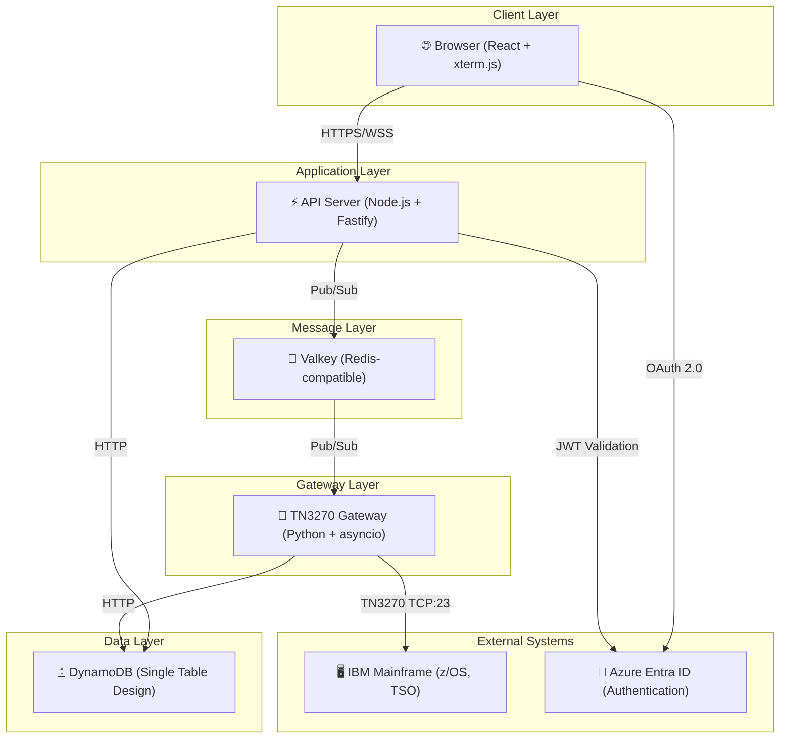
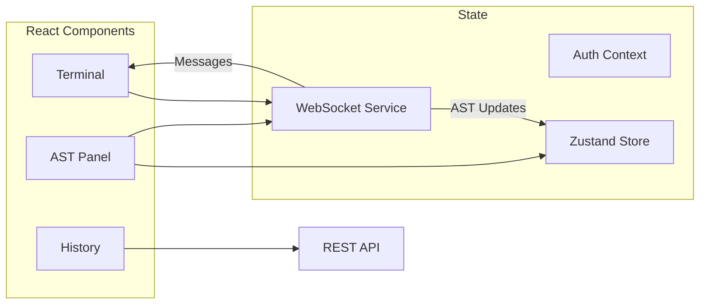
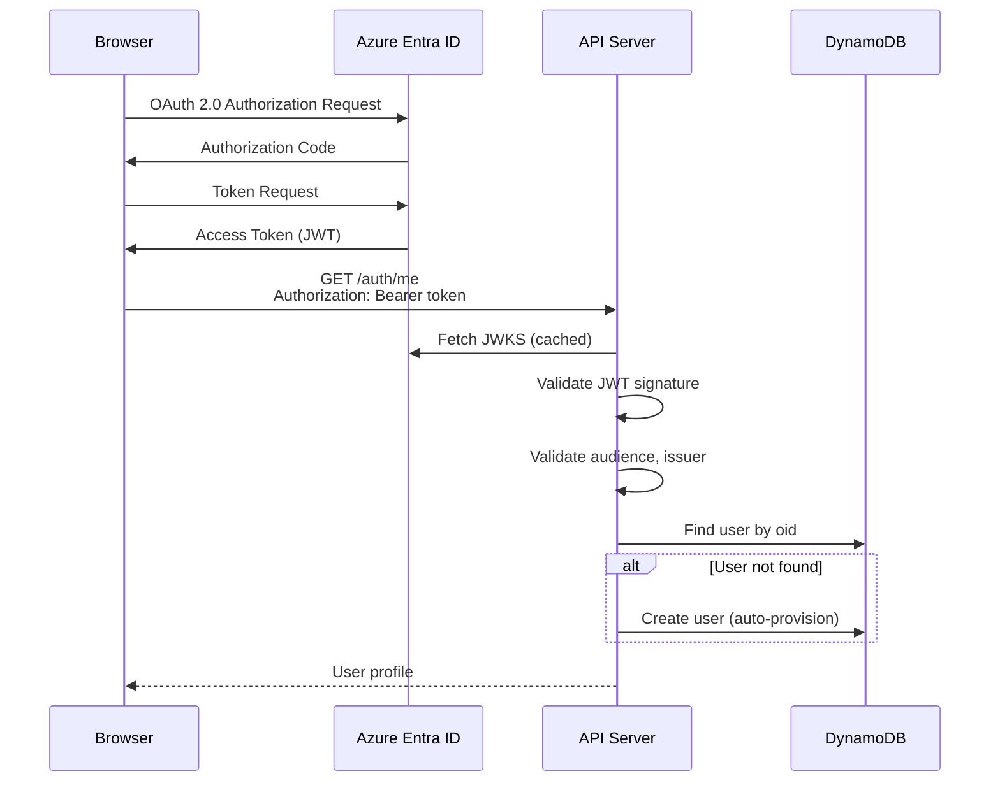
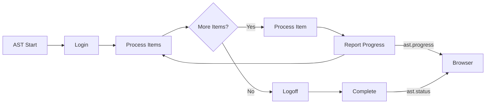

# IAST - Interactive Automated Streamlined Terminal

## Executive Summary

IAST is a web-based TN3270 terminal emulator and automation platform that enables secure browser-based access to IBM mainframe systems. It provides real-time terminal emulation with support for Automated Streamlined Transactions (ASTs) - automated scripts that can perform complex mainframe operations.

## System Overview



## Technology Stack

| Layer | Technology | Purpose |
|-------|------------|---------|
| **Frontend** | React 19, Vite 7, TypeScript 5.9 | UI Framework |
| | xterm.js | Terminal emulation |
| | TanStack Router | Client-side routing |
| | Zustand | State management |
| | MSAL.js | Azure AD authentication |
| | Tailwind CSS v4 | Styling |
| **API Server** | Node.js, Fastify 5 | HTTP/WebSocket server |
| | ioredis | Valkey client |
| | jose | JWT validation |
| | AWS SDK v3 | DynamoDB client |
| **Gateway** | Python 3.11+, asyncio | TN3270 protocol handling |
| | tnz library | 3270 terminal emulation |
| | redis-py | Valkey client |
| | boto3 | DynamoDB client |
| **Message Broker** | Valkey (Redis-compatible) | Pub/Sub messaging |
| **Database** | AWS DynamoDB | Persistent storage |
| **Authentication** | Azure Entra ID | Identity provider |

## Architecture Components

### 1. Web Frontend (`apps/web`)

The frontend is a single-page application (SPA) providing:

- **Terminal Emulation**: Full TN3270 terminal rendering using xterm.js with ANSI escape sequence support
- **Multi-Tab Sessions**: Multiple concurrent terminal sessions with tab management
- **AST Panel**: Form-based interface for running automated transactions
- **Execution History**: View and track AST execution history
- **Authentication**: Azure Entra ID SSO via MSAL.js

**Key Files:**

```
apps/web/src/
├── components/
│   └── Terminal.tsx          # xterm.js terminal component
├── hooks/
│   ├── useTerminal.ts        # Terminal + WebSocket integration
│   ├── useAuth.ts            # Authentication state
│   └── useAST.ts             # AST state management
├── stores/
│   └── astStore.ts           # Zustand store for per-tab AST state
├── services/
│   └── websocket.ts          # WebSocket client with reconnection
├── ast/                      # AST panel components
└── routes/
    ├── index.tsx             # Terminal page with tabs
    └── history/route.tsx     # Execution history page
```

**State Flow:**



### 2. API Server (`apps/api`)

The API server acts as the bridge between the browser and the TN3270 gateway:

- **WebSocket Endpoint**: `/terminal/:sessionId` for real-time terminal communication
- **REST API**: User info, sessions, and execution history
- **Authentication**: Azure Entra ID token validation via jose library
- **Message Routing**: Forwards messages between browser and gateway via Valkey

**Key Files:**

```
apps/api/src/
├── server/
│   └── app.ts                # Fastify application setup
├── routes/
│   ├── auth.ts               # User info (auto-provisions from Entra)
│   ├── sessions.ts           # Session CRUD
│   └── history.ts            # Execution history
├── ws/
│   └── terminal.ts           # WebSocket handler
├── services/
│   ├── auth.ts               # Entra token validation
│   ├── session.ts            # Session management
│   └── dynamodb.ts           # Database client
└── valkey/
    └── client.ts             # Valkey pub/sub client
```

**API Endpoints:**

| Method | Path | Description |
|--------|------|-------------|
| `GET` | `/auth/me` | Get current user (auto-provisions) |
| `GET` | `/sessions` | List user's sessions |
| `POST` | `/sessions` | Create new session |
| `PUT` | `/sessions/:id` | Update session |
| `DELETE` | `/sessions/:id` | Delete session |
| `GET` | `/history` | List execution history |
| `GET` | `/history/:id/policies` | Get execution policy results |
| `WS` | `/terminal/:sessionId?token=xxx` | WebSocket terminal |
| `GET` | `/health` | Health check with DynamoDB validation |

### 3. TN3270 Gateway (`gateway`)

The gateway handles TN3270 protocol communication with mainframes:

- **Session Management**: Creates/manages TN3270 connections via tnz library
- **Screen Rendering**: Converts 3270 screen data to ANSI escape sequences
- **Key Translation**: Maps xterm.js keyboard input to 3270 keys (PF1-24, PA1-3, Enter, etc.)
- **AST Execution**: Runs automated scripts against mainframe sessions
- **Field Detection**: Extracts protected/unprotected field positions

**Key Files:**

```
gateway/src/
├── app.py                    # Main application entry
├── services/
│   ├── valkey.py             # Async Valkey client
│   └── tn3270/
│       ├── manager.py        # Session manager
│       ├── host.py           # Host interaction abstraction
│       └── renderer.py       # 3270 → ANSI conversion
├── ast/
│   └── login.py              # Example AST implementation
├── core/
│   ├── ast/
│   │   ├── base.py           # AST base class
│   │   ├── executor.py       # Sequential/Parallel executors
│   │   ├── persistence.py    # Execution history storage
│   │   └── runner.py         # AST runner
│   ├── channels.py           # Pub/sub channel definitions
│   └── config.py             # Configuration
├── db/
│   └── client.py             # DynamoDB single-table client
└── models/
    └── *.py                  # Pydantic message models
```

**3270 Key Mappings:**

| Input | 3270 Key |
|-------|----------|
| F1-F12 | PF1-PF12 |
| Shift+F1-F12 | PF13-PF24 |
| Ctrl+F1-F3 | PA1-PA3 |
| Enter | Enter |
| Tab | Tab |
| Shift+Tab | Backtab |
| Insert | Clear |
| Arrow Keys | Cursor movement |

### 4. Shared Package (`packages/shared`)

TypeScript types and utilities shared between frontend and API:

```typescript
// Message types (discriminated unions)
type MessageType = 
  | 'data'           // Terminal I/O
  | 'resize'         // Terminal resize
  | 'ping' | 'pong'  // Heartbeat
  | 'error'          // Error messages
  | 'session.create' | 'session.destroy'
  | 'session.created' | 'session.destroyed'
  | 'tn3270.screen'  // Screen update with field data
  | 'ast.run' | 'ast.control'
  | 'ast.status' | 'ast.paused';

// Channel definitions
const CHANNELS = {
  TN3270_INPUT: 'tn3270.input.<sessionId>',   // Browser → Gateway
  TN3270_OUTPUT: 'tn3270.output.<sessionId>', // Gateway → Browser
  TN3270_CONTROL: 'tn3270.control',           // Session control
  GATEWAY_CONTROL: 'gateway.control',          // Gateway commands
  SESSIONS: 'sessions.events',                 // Session events
};
```

## Data Flow

### Terminal Session Lifecycle

```mermaid
sequenceDiagram
    autonumber
    participant B as Browser
    participant A as API Server
    participant V as Valkey
    participant G as Gateway
    participant M as Mainframe

    rect rgb(40, 60, 80)
        Note over B,M: 1. Connection Establishment
        B->>A: WebSocket Connect<br/>/terminal/:sessionId?token=xxx
        A->>A: Validate Entra JWT
        A->>A: Create session record
    end

    rect rgb(60, 80, 40)
        Note over B,M: 2. TN3270 Session Creation
        B->>A: session.create message
        A->>V: PUBLISH tn3270.input/:id
        V->>G: MESSAGE
        G->>M: TN3270 Connect (TCP)
        M-->>G: Connection Established
        G->>V: PUBLISH tn3270.output/:id<br/>(session.created)
        V->>A: MESSAGE
        A-->>B: session.created
    end

    rect rgb(80, 60, 40)
        Note over B,M: 3. Screen Updates
        M-->>G: 3270 Screen Data
        G->>G: Convert to ANSI + Extract Fields
        G->>V: PUBLISH tn3270.output/:id<br/>(tn3270.screen)
        V->>A: MESSAGE
        A-->>B: tn3270.screen + field map
        B->>B: Render in xterm.js
    end

    rect rgb(40, 80, 60)
        Note over B,M: 4. User Input
        B->>A: data message (keystroke)
        A->>V: PUBLISH tn3270.input/:id
        V->>G: MESSAGE
        G->>G: Translate to 3270 key
        G->>M: 3270 Key/Data
    end

    rect rgb(80, 40, 60)
        Note over B,M: 5. AST Execution
        B->>A: ast.run message
        A->>V: PUBLISH tn3270.input/:id
        V->>G: MESSAGE
        G->>G: Execute AST
        loop For each step
            G->>M: Automated input
            M-->>G: Screen response
            G->>V: ast.progress
            V->>A: MESSAGE
            A-->>B: Progress update
        end
        G->>V: ast.status (completed)
        V->>A: MESSAGE
        A-->>B: AST completed
    end
```



### Authentication Flow



## Data Model (DynamoDB Single Table Design)

```mermaid
erDiagram
    USER ||--o{ SESSION : has
    SESSION ||--o{ EXECUTION : contains
    EXECUTION ||--o{ POLICY_RESULT : produces

    USER {
        string PK "USER#userId"
        string SK "PROFILE"
        string email
        string displayName
        datetime createdAt
    }
    
    SESSION {
        string PK "USER#userId"
        string SK "SESSION#sessionId"
        string name
        datetime createdAt
        datetime lastActivity
    }
    
    EXECUTION {
        string PK "SESSION#sessionId"
        string SK "EXECUTION#execId"
        string astName
        string status
        datetime startedAt
        datetime completedAt
        int totalItems
        int completedItems
    }
    
    POLICY_RESULT {
        string PK "EXECUTION#execId"
        string SK "POLICY#policyNum"
        string status
        json data
        datetime processedAt
    }
```

**Key Structure:**

| Entity | PK | SK | GSI1PK | GSI2PK |
|--------|----|----|--------|--------|
| User Profile | `USER#<userId>` | `PROFILE` | `<email>` | - |
| Session | `USER#<userId>` | `SESSION#<sessionId>` | - | - |
| Execution | `SESSION#<sessionId>` | `EXECUTION#<execId>` | - | `USER#<userId>#DATE#<date>` |
| Policy Result | `EXECUTION#<execId>` | `POLICY#<policyNum>` | - | - |

## Message Protocol

All WebSocket and Pub/Sub messages use a consistent envelope format:

```typescript
interface MessageEnvelope {
  type: MessageType;          // Discriminator
  sessionId: string;          // Session identifier
  timestamp: number;          // Unix timestamp (ms)
  encoding: 'utf-8' | 'base64';
  seq: number;                // Sequence number
  payload: string;            // Message data
  meta?: Record<string, unknown>;  // Type-specific metadata
}
```

**Key Message Types:**

| Type | Direction | Purpose | Meta Fields |
|------|-----------|---------|-------------|
| `data` | Bidirectional | Terminal I/O | - |
| `tn3270.screen` | Gateway → Browser | Screen update | `fields`, `cursorRow`, `cursorCol`, `rows`, `cols` |
| `session.create` | Browser → Gateway | Create TN3270 session | `terminalType`, `cols`, `rows` |
| `ast.run` | Browser → Gateway | Start AST execution | `astName`, `params` |
| `ast.status` | Gateway → Browser | AST completion | `status`, `result`, `error` |
| `ast.progress` | Gateway → Browser | AST progress | `current`, `total`, `currentItem` |
| `error` | Any | Error notification | `code`, `details` |

## AST (Automated Streamlined Transaction) System

ASTs are Python classes that automate mainframe interactions:

```python
class LoginAST(AST):
    """Automated login and policy processing."""
    
    name = "login"
    description = "Login to TSO and process policies"
    supports_parallel = True  # Can run in parallel sessions
    
    def login(self, host: Host, username: str, password: str) -> bool:
        """Authenticate to the mainframe."""
        host.wait_for_text("USERID")
        host.fill_field_at_position(row, col, username)
        host.pf(1)  # Press PF1
        return host.wait_for_text("READY")
    
    def process_single_item(self, host: Host, item: str, 
                            index: int, total: int) -> tuple[bool, str, dict]:
        """Process a single policy number."""
        # Navigate to policy screen
        # Extract data
        # Return (success, message, data)
        pass
    
    def logoff(self, host: Host) -> bool:
        """Sign off from the session."""
        host.pf(15)  # Exit
        return host.wait_for_text("SIGNON")
```

**Execution Modes:**

- **Sequential**: Single session processes all items
- **Parallel**: Multiple sessions divide the workload

**Progress Reporting:**



## Security Architecture

### Authentication & Authorization

1. **Azure Entra ID Integration**
   - OAuth 2.0 authorization code flow with PKCE
   - Access tokens validated via JWKS (cached)
   - User auto-provisioned on first login

2. **Token Validation (jose library)**
   - Signature verification against Microsoft JWKS
   - Audience validation (API client ID)
   - Issuer validation (tenant-specific)
   - Expiration checking

3. **WebSocket Security**
   - Token passed via query parameter (`?token=xxx`)
   - Validated before session creation
   - Sessions bound to user ID

### Data Protection

- All external communication over TLS
- Mainframe credentials never stored (passed at runtime)
- Session IDs are UUIDs
- DynamoDB encrypted at rest

## Directory Structure

```
terminal/
├── apps/
│   ├── api/                    # Node.js API server
│   │   ├── package.json
│   │   └── src/
│   │       ├── index.ts        # Entry point
│   │       ├── config/         # Configuration
│   │       ├── models/         # Data models
│   │       ├── routes/         # HTTP routes
│   │       ├── server/         # Fastify setup
│   │       ├── services/       # Business logic
│   │       ├── valkey/         # Pub/sub client
│   │       └── ws/             # WebSocket handlers
│   │
│   └── web/                    # React frontend
│       ├── package.json
│       └── src/
│           ├── main.tsx        # Entry point
│           ├── ast/            # AST panel components
│           ├── components/     # UI components
│           ├── config/         # Configuration
│           ├── context/        # React contexts
│           ├── hooks/          # React hooks
│           ├── providers/      # Context providers
│           ├── routes/         # Page components
│           ├── services/       # API/WebSocket clients
│           ├── stores/         # Zustand stores
│           └── utils/          # Utilities
│
├── gateway/                    # Python TN3270 gateway
│   ├── pyproject.toml
│   ├── requirements.txt
│   └── src/
│       ├── app.py              # Entry point
│       ├── cli.py              # CLI commands
│       ├── ast/                # AST implementations
│       ├── core/               # Core modules
│       │   ├── ast/            # AST framework
│       │   ├── channels.py     # Channel definitions
│       │   ├── config.py       # Configuration
│       │   └── errors.py       # Error handling
│       ├── db/                 # DynamoDB client
│       ├── models/             # Pydantic models
│       └── services/           # Services
│           ├── valkey.py       # Valkey client
│           └── tn3270/         # TN3270 handling
│
├── packages/
│   └── shared/                 # Shared TypeScript types
│       └── src/
│           ├── index.ts
│           ├── messages.ts     # Message types
│           ├── channels.ts     # Channel constants
│           ├── config.ts       # Config types
│           └── errors.ts       # Error codes
│
├── infra/
│   └── docker-compose.dev.yml  # Local infrastructure
│
├── scripts/
│   ├── dev.sh                  # Development startup
│   └── setup-dynamodb.sh       # DynamoDB table creation
│
└── docs/
    ├── ARCHITECTURE.md         # This document
    ├── AWS_DEPLOYMENT.md       # Deployment guide
    └── diagrams.md             # Additional diagrams
```

## Configuration

### Environment Variables

**API Server (`apps/api/.env`):**

```env
PORT=3000
HOST=0.0.0.0
LOG_LEVEL=info

# Valkey
VALKEY_HOST=localhost
VALKEY_PORT=6379

# DynamoDB
DYNAMODB_ENDPOINT=http://localhost:8042
DYNAMODB_REGION=us-east-1
DYNAMODB_TABLE_NAME=terminal
DYNAMODB_ACCESS_KEY_ID=dummy
DYNAMODB_SECRET_ACCESS_KEY=dummy

# Azure Entra ID
ENTRA_TENANT_ID=your-tenant-id
ENTRA_CLIENT_ID=your-api-client-id
ENTRA_AUDIENCE=api://your-api-client-id
```

**Web Frontend (`apps/web/.env`):**

```env
VITE_API_URL=http://localhost:3000
VITE_WS_URL=ws://localhost:3000

# Azure Entra ID (SPA)
VITE_ENTRA_CLIENT_ID=your-spa-client-id
VITE_ENTRA_TENANT_ID=your-tenant-id
VITE_ENTRA_REDIRECT_URI=http://localhost:5173
VITE_ENTRA_API_SCOPE=api://your-api-client-id/.default
```

**Gateway (`gateway/.env`):**

```env
# Valkey
VALKEY_HOST=localhost
VALKEY_PORT=6379

# TN3270
TN3270_HOST=mainframe.example.com
TN3270_PORT=23
TN3270_MAX_SESSIONS=10

# DynamoDB
DYNAMODB_ENDPOINT=http://localhost:8042
DYNAMODB_REGION=us-east-1
DYNAMODB_TABLE_NAME=terminal
DYNAMODB_ACCESS_KEY_ID=dummy
DYNAMODB_SECRET_ACCESS_KEY=dummy
```

## Error Handling

The system uses typed error codes throughout:

```typescript
const ERROR_CODES = {
  // Authentication
  AUTH_REQUIRED: 'AUTH_001',
  AUTH_INVALID_TOKEN: 'AUTH_002',
  AUTH_TOKEN_EXPIRED: 'AUTH_003',
  
  // Session
  SESSION_NOT_FOUND: 'SESSION_001',
  SESSION_LIMIT_REACHED: 'SESSION_002',
  
  // Terminal
  TERMINAL_CONNECTION_FAILED: 'TERMINAL_001',
  TERMINAL_DISCONNECTED: 'TERMINAL_002',
  
  // AST
  AST_NOT_FOUND: 'AST_001',
  AST_EXECUTION_FAILED: 'AST_002',
  AST_ALREADY_RUNNING: 'AST_003',
  
  // WebSocket
  WS_MESSAGE_INVALID: 'WS_001',
  
  // Internal
  INTERNAL_ERROR: 'INTERNAL_001',
};
```

## Performance Considerations

1. **WebSocket Connection Management**
   - Automatic reconnection with exponential backoff
   - Heartbeat ping/pong every 30 seconds
   - Maximum 5 reconnection attempts

2. **Message Handling**
   - Messages serialized as JSON (UTF-8)
   - Large payloads use base64 encoding
   - Sequence numbers for ordering

3. **Caching**
   - JWKS cached for 1 hour
   - Session state in memory (API server)
   - TN3270 sessions pooled (gateway)

4. **Database**
   - DynamoDB on-demand capacity
   - Single table design for efficient queries
   - GSIs for common access patterns

## Related Documentation

- [AWS Deployment Guide](./AWS_DEPLOYMENT.md) - Production deployment
- [Diagrams](./diagrams.md) - Additional architecture diagrams
