# IAST Architecture

## Overview

IAST (Interactive Automated Streamlined Terminal) is a web-based TN3270 terminal emulator with automation capabilities for IBM mainframe systems. The architecture uses a simple WebSocket bridge pattern for real-time communication.

## System Architecture

```mermaid
flowchart TB
    subgraph "Client"
        Browser["🌐 Browser<br>(React + xterm.js)"]
    end
    
    subgraph "API Layer"
        API["⚡ API Server<br>(Node.js + Fastify)"]
    end
    
    subgraph "Gateway Layer"
        Gateway["🐍 TN3270 Gateway<br>(Python + asyncio)"]
    end
    
    subgraph "Data Layer"
        DynamoDB["🗄️ DynamoDB"]
    end
    
    subgraph "External"
        Mainframe["🖥️ IBM Mainframe"]
        EntraID["🔐 Azure Entra ID"]
    end
    
    Browser <-->|"WSS Bridge"| API
    API <-->|"WS"| Gateway
    Gateway <-->|"TN3270"| Mainframe
    
    API -->|"HTTPS"| DynamoDB
    Gateway -->|"HTTPS"| DynamoDB
    Browser -->|"OAuth 2.0"| EntraID
```



## Key Architectural Decisions

### 1. WebSocket Bridge

The API server acts as a **transparent WebSocket bridge** between browser and gateway:

```text
Browser WebSocket ←→ API Server ←→ Gateway WebSocket ←→ TN3270 Connection
```

**Benefits:**

- **Simple**: Direct message forwarding with no transformation
- **Low latency**: No serialization/deserialization overhead
- **Easy debugging**: Messages pass through unchanged
- **Session affinity**: Each browser session is bound to one gateway instance

### 2. Single-Table DynamoDB Design

All data stored in one DynamoDB table with composite keys:

| Record Type | PK | SK |
|-------------|----|----|
| User | `USER#{userId}` | `PROFILE` |
| Session | `USER#{userId}` | `SESSION#{sessionId}` |
| Gateway Mapping | `SESSION#{sessionId}` | `GATEWAY#mapping` |
| Execution | `SESSION#{sessionId}` | `EXEC#{executionId}` |
| Policy Result | `EXEC#{executionId}` | `POLICY#{policyNumber}` |

### 3. Per-Tab State Management

Each browser tab maintains independent state using Zustand stores:

- **Session Store**: WebSocket connection, screen buffer, cursor position
- **AST Store**: Per-tab AST execution state (progress, results, logs)

## Components

### Web Frontend (`apps/web`)

React 19 SPA with:

- **xterm.js** terminal emulation with TN3270 keyboard support
- **Multi-tab sessions** with independent state per tab
- **AST Panel** for running automated transactions
- **Execution History** with real-time progress tracking
- **Azure Entra ID** authentication via MSAL.js

**Key Files:**

```
apps/web/src/
├── components/
│   ├── Terminal.tsx           # xterm.js terminal
│   └── SessionExpiredModal.tsx
├── hooks/
│   ├── useTerminal.ts         # Terminal + WebSocket integration
│   ├── useAST.ts              # AST state hook
│   └── useFormField.ts        # Persisted form fields
├── stores/
│   ├── sessionStore.ts        # WebSocket + screen state
│   └── astStore.ts            # Per-tab AST state
├── ast/
│   ├── shared/                # Common components
│   ├── login/                 # Login AST form
│   └── bi-renew/              # BI Renew AST form
└── routes/
    ├── index.tsx              # Terminal page
    └── history/route.tsx      # Execution history
```

### API Server (`apps/api`)

Fastify server that:

- **Bridges WebSocket connections** between browser and gateway
- **Validates JWT tokens** from Azure Entra ID
- **Manages sessions** in DynamoDB
- **Routes traffic** to appropriate gateway instance

**Key Files:**

```
apps/api/src/
├── ws/
│   ├── terminal.ts            # WebSocket endpoint handler
│   └── bridge.ts              # Bidirectional WS forwarding
├── routes/
│   ├── auth.ts                # User provisioning
│   ├── sessions.ts            # Session CRUD
│   └── history.ts             # Execution history API
└── services/
    ├── auth.ts                # JWT validation
    ├── dynamodb.ts            # DynamoDB client
    └── gatewayRouter.ts       # Gateway instance lookup
```

**API Endpoints:**

| Method | Path | Description |
|--------|------|-------------|
| `WS` | `/terminal/:sessionId` | WebSocket terminal |
| `GET` | `/auth/me` | Get/provision current user |
| `GET/POST/PUT/DELETE` | `/sessions` | Session CRUD |
| `GET` | `/sessions/:id/execution` | Active execution for session |
| `GET` | `/history` | Execution history |
| `GET` | `/history/:id/policies` | Policy results |

### TN3270 Gateway (`gateway`)

Python asyncio service that:

- **Manages TN3270 connections** via tnz library
- **Runs WebSocket server** for API connections
- **Renders 3270 screens** to ANSI escape sequences
- **Executes ASTs** (automated scripts)
- **Persists execution results** to DynamoDB

**Key Files:**

```
gateway/src/
├── app.py                     # Main entry point
├── services/
│   ├── websocket.py           # WebSocket server
│   └── tn3270/
│       ├── manager.py         # Session manager
│       ├── host.py            # Mainframe interaction
│       └── renderer.py        # 3270 → ANSI rendering
├── core/
│   └── ast/
│       ├── base.py            # AST base class
│       ├── executor.py        # Parallel/sequential execution
│       └── persistence.py     # Result storage
└── ast/
    └── login.py               # Login AST implementation
```

## Message Flow

### Terminal Input


### AST Execution


## Session Lifecycle


### Session Expiry

When a browser disconnects:

1. Gateway waits **60 seconds** (grace period)
2. If no reconnection, TN3270 session is destroyed
3. If user tries to use the session later:
   - Gateway sends `SESSION_EXPIRED` error
   - Browser shows "Session Expired" modal
   - User can create a new TN3270 session

## DynamoDB Records

### Session Record

Created when user creates a new session in the UI.

```json
{
  "PK": "USER#dev-user-001",
  "SK": "SESSION#abc123",
  "sessionId": "abc123",
  "name": "My Session",
  "userId": "dev-user-001",
  "createdAt": 1234567890,
  "updatedAt": 1234567890
}
```

### Gateway Mapping

Created when WebSocket connects, maps session to gateway instance.

```json
{
  "PK": "SESSION#abc123",
  "SK": "GATEWAY#mapping",
  "instanceIp": "10.0.1.5",
  "status": "active",
  "ttl": 1234567890  // Auto-expires
}
```

### Execution Record

Created when AST execution starts.

```json
{
  "PK": "SESSION#abc123",
  "SK": "EXEC#exec-001",
  "executionId": "exec-001",
  "ast_name": "login",
  "status": "running",
  "total_items": 94,
  "success_count": 50,
  "failed_count": 2,
  "createdAt": "2024-01-01T00:00:00Z"
}
```

### Policy Result

One record per policy processed.

```json
{
  "PK": "EXEC#exec-001",
  "SK": "POLICY#A1B2C3D4E",
  "policyNumber": "A1B2C3D4E",
  "status": "success",
  "durationMs": 1500,
  "data": { "renewalDate": "2025-01-01" },
  "createdAt": "2024-01-01T00:00:01Z"
}
```

## Technology Stack

| Layer | Technology | Purpose |
|-------|------------|---------|
| **Frontend** | React 19, TypeScript, Vite | UI framework |
| | xterm.js | Terminal emulation |
| | Zustand | State management |
| | TanStack Router | Client routing |
| | MSAL.js | Azure AD auth |
| **API** | Node.js, Fastify | HTTP/WebSocket server |
| | jose | JWT validation |
| | AWS SDK v3 | DynamoDB |
| **Gateway** | Python 3.12+, asyncio | TN3270 protocol |
| | tnz | 3270 emulation |
| | websockets | WebSocket server |
| | boto3 | DynamoDB |
| **Database** | DynamoDB | Session/execution storage |
| **Auth** | Azure Entra ID | SSO/JWT tokens |
