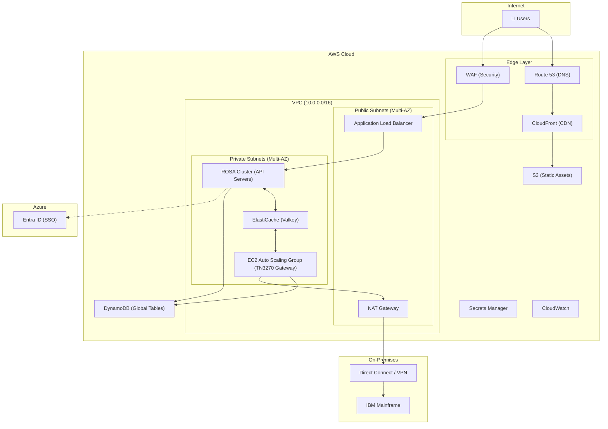
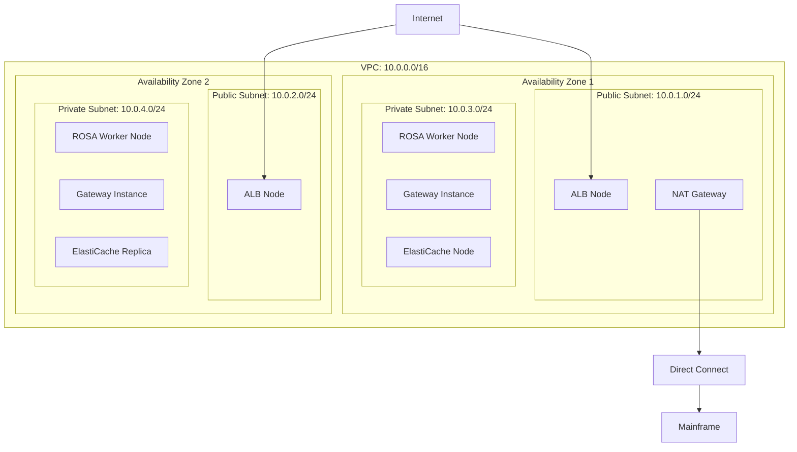
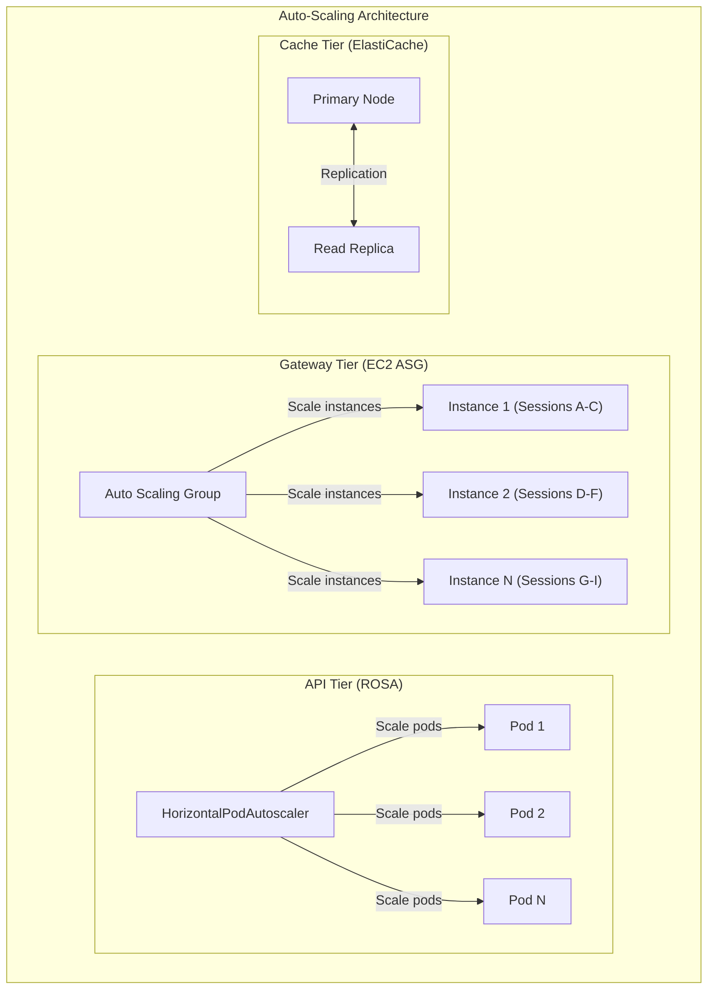
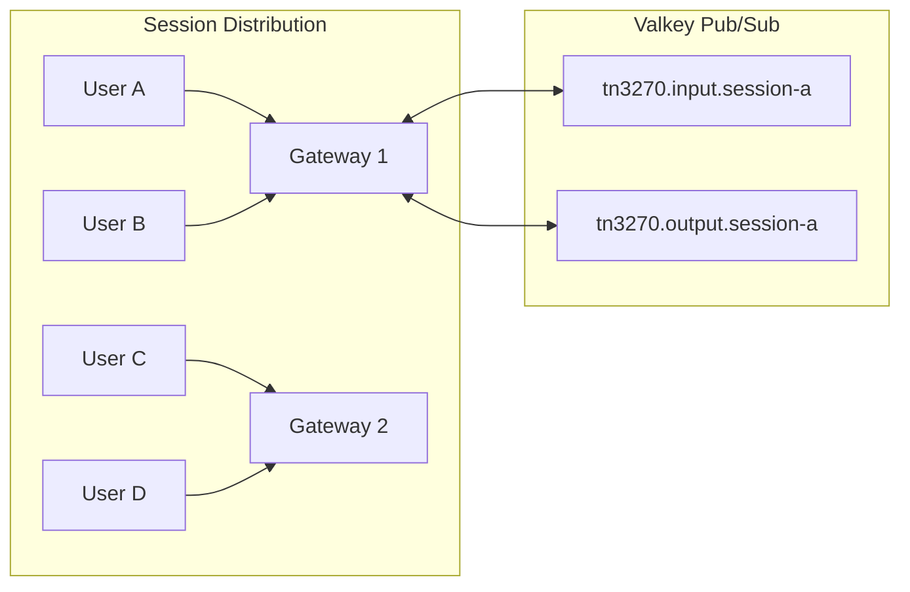
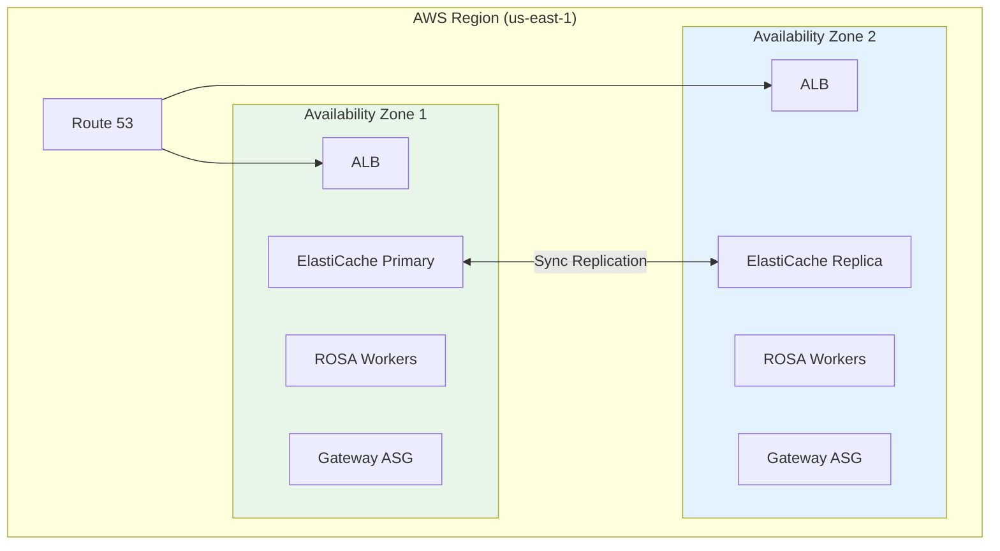
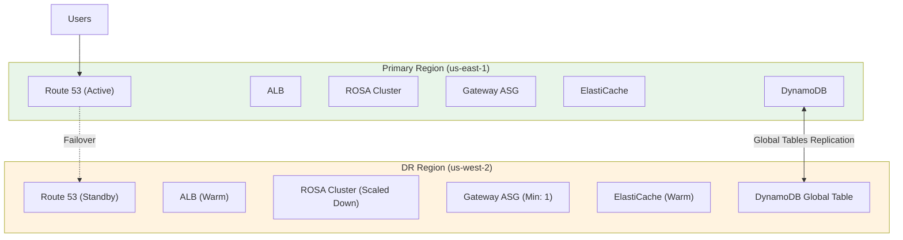
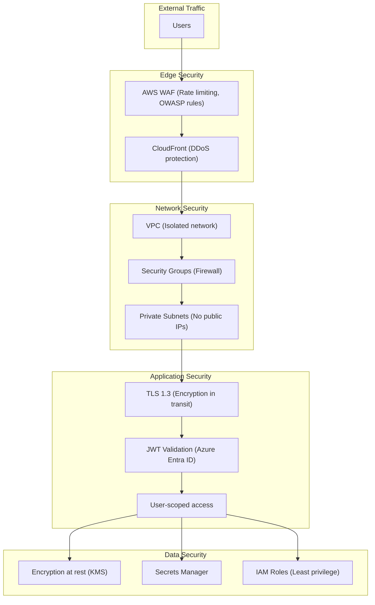
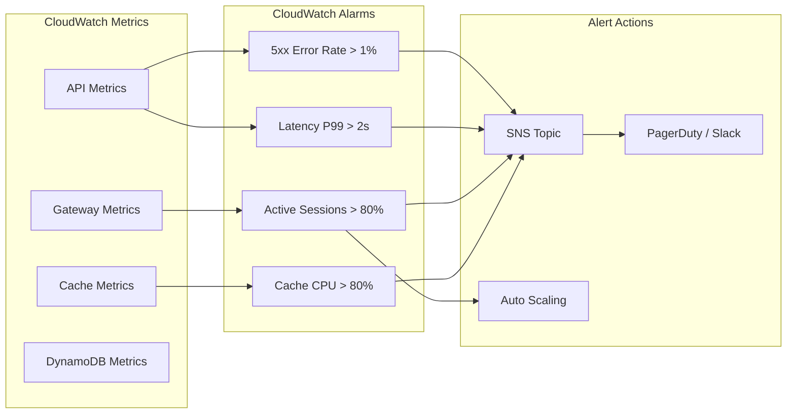

# AWS Deployment Guide

This guide covers deploying the IAST (Interactive Automated Streamlined Terminal) application to AWS for production use.

## Table of Contents

1. [Architecture Overview](#architecture-overview)
2. [Infrastructure Components](#infrastructure-components)
3. [Scaling Strategy](#scaling-strategy)
4. [High Availability & Failover](#high-availability--failover)
5. [Security Architecture](#security-architecture)
6. [Monitoring & Alerting](#monitoring--alerting)

---

## Architecture Overview

---

## Infrastructure Components

### Component Matrix

| Component | AWS Service | Purpose | HA Strategy |
|-----------|-------------|---------|-------------|
| **Web Frontend** | S3 + CloudFront | Static assets hosting | Global CDN replication |
| **DNS** | Route 53 | DNS + health checks | Built-in global HA |
| **Load Balancer** | ALB | HTTPS termination, WebSocket routing | Multi-AZ |
| **API Server** | ROSA (OpenShift) | REST API + WebSocket handling | Pod replicas across AZs |
| **TN3270 Gateway** | EC2 Auto Scaling | Mainframe connectivity | Multi-AZ ASG |
| **Message Broker** | ElastiCache (Redis) | Pub/Sub messaging | Multi-AZ with failover |
| **Database** | DynamoDB | User data, sessions, history | Global Tables (multi-region) |
| **Secrets** | Secrets Manager | API keys, credentials | Regional replication |
| **Mainframe Access** | Direct Connect / VPN | Private connectivity | Redundant connections |

### Why This Architecture?

**ROSA for API Servers:**

- Kubernetes-native scaling with HPA
- Rolling deployments with zero downtime
- Enterprise container platform with Red Hat support
- Integrated monitoring and logging

**EC2 for TN3270 Gateway (not containers):**

- Long-running TCP connections (hours/days)
- Direct network access to mainframes via Direct Connect
- In-memory session state that can't be easily migrated
- Predictable resource allocation for TN3270 sessions

### Network Architecture

### Security Groups

| Security Group | Inbound | Outbound | Purpose |
|----------------|---------|----------|---------|
| `iast-alb-sg` | 443 from 0.0.0.0/0 | All | Public HTTPS access |
| `iast-rosa-sg` | 3000 from ALB-SG | All | API server traffic |
| `iast-gateway-sg` | 6379 from Cache-SG | 23 to Mainframe, 6379 to Cache | Gateway traffic |
| `iast-cache-sg` | 6379 from ROSA-SG, Gateway-SG | None | ElastiCache access |

---

## Scaling Strategy

### Horizontal Scaling Diagram

### Scaling Rules

| Component | Metric | Scale Out | Scale In | Min | Max |
|-----------|--------|-----------|----------|-----|-----|
| **API (ROSA)** | CPU > 70% | +50% pods | -25% pods | 2 | 20 |
| **API (ROSA)** | Memory > 80% | +50% pods | -25% pods | 2 | 20 |
| **Gateway (EC2)** | Active Sessions > 50/instance | +1 instance | -1 instance | 2 | 20 |
| **Gateway (EC2)** | CPU > 70% | +2 instances | -1 instance | 2 | 20 |
| **ElastiCache** | Memory > 80% | Vertical scale | - | - | - |

### Capacity Planning

| Load Level | Concurrent Users | API Pods | Gateway Instances | ElastiCache |
|------------|------------------|----------|-------------------|-------------|
| **Development** | 1-10 | 2 | 1 | cache.t3.micro |
| **Low** | 10-100 | 2-4 | 2 | cache.r6g.large |
| **Medium** | 100-500 | 4-8 | 4-6 | cache.r6g.xlarge |
| **High** | 500-1000 | 8-12 | 8-10 | cache.r6g.2xlarge |
| **Enterprise** | 1000+ | 12-20 | 10-20 | Redis Cluster |

### Session Affinity

**Key Points:**

- TN3270 sessions are bound to specific Gateway instances
- Valkey pub/sub routes messages to the correct Gateway
- If a Gateway fails, sessions must be re-established (no migration)
- ALB uses sticky sessions for WebSocket connections

---

## High Availability & Failover

### Multi-AZ Architecture

### Multi-Region Disaster Recovery

### Failover Scenarios

| Failure Type | Detection | Recovery Action | RTO | RPO |
|--------------|-----------|-----------------|-----|-----|
| **Single Gateway Instance** | ASG Health Check | Auto-replace instance | 2-5 min | 0 (sessions reconnect) |
| **Single API Pod** | K8s Liveness Probe | Auto-restart pod | 30 sec | 0 |
| **Availability Zone** | ALB Health Check | Route to healthy AZ | 1-2 min | 0 |
| **ElastiCache Primary** | ElastiCache Auto-failover | Promote replica | 1-2 min | ~1 sec |
| **Entire Region** | Route 53 Health Check | DNS failover to DR | 5-15 min | ~1 min |

### Health Check Configuration

| Component | Health Check Type | Endpoint | Interval | Threshold |
|-----------|-------------------|----------|----------|-----------|
| **ALB → API** | HTTP | `/health` | 30s | 2 failures |
| **Route 53 → ALB** | HTTPS | `/health` | 30s | 3 failures |
| **ASG → Gateway** | EC2 | Instance status | 60s | 2 failures |
| **ElastiCache** | Built-in | Automatic | - | Automatic |

### Recovery Procedures

**AZ Failure:**

1. ALB automatically routes to healthy AZ
2. ASG launches replacement instances in healthy AZ
3. ROSA scheduler places pods in healthy AZ
4. Users reconnect to new Gateway instances

**Region Failure:**

1. Route 53 detects ALB health check failures
2. DNS automatically fails over to DR region (TTL: 60s)
3. DR region ROSA scales up to handle load
4. DR Gateway ASG scales to match demand
5. DynamoDB Global Tables already in sync
6. Users reconnect (sessions lost, data preserved)

---

## Security Architecture

### Security Layers

### Secrets Required

| Secret | Service | Purpose |
|--------|---------|---------|
| `iast/entra` | API Server | Azure Entra ID tenant/client IDs |
| `iast/valkey` | API + Gateway | ElastiCache connection string |
| `iast/tn3270` | Gateway | Mainframe host and port |

### IAM Roles

| Role | Assigned To | Permissions |
|------|-------------|-------------|
| `iast-api-role` | ROSA Pods | DynamoDB, Secrets Manager (read) |
| `iast-gateway-role` | EC2 Instances | DynamoDB, Secrets Manager (read), CloudWatch (write), ECR (pull) |

---

## Monitoring & Alerting

### Key Metrics Dashboard

### Critical Alerts

| Alert | Condition | Severity | Action |
|-------|-----------|----------|--------|
| **High Error Rate** | 5xx errors > 10/min | Critical | Page on-call |
| **High Latency** | P99 > 2 seconds | Warning | Investigate |
| **Gateway Capacity** | Sessions > 80% capacity | Warning | Scale out |
| **Cache Memory** | Memory > 85% | Critical | Vertical scale |
| **DynamoDB Throttling** | Throttled requests > 0 | Warning | Check capacity |
| **Gateway Unhealthy** | Unhealthy instances > 0 | Critical | Check ASG |

### Logging Strategy

| Component | Log Destination | Retention |
|-----------|-----------------|-----------|
| API Server | CloudWatch Logs `/iast/api` | 30 days |
| Gateway | CloudWatch Logs `/iast/gateway` | 30 days |
| ALB Access Logs | S3 bucket | 90 days |
| WAF Logs | CloudWatch Logs | 30 days |

---

## Quick Reference

### Resource Summary

| Resource | Name | Notes |
|----------|------|-------|
| VPC | `iast-vpc` | 10.0.0.0/16 |
| ROSA Cluster | `iast-rosa` | 2+ worker nodes |
| EC2 ASG | `iast-gateway-asg` | c5.xlarge instances |
| ElastiCache | `iast-cache` | Redis 7.0, Multi-AZ |
| DynamoDB | `iast-terminal` | On-demand, Global Tables |
| S3 | `iast-web-*` | Static assets |
| ALB | `iast-alb` | HTTPS + WebSocket |

### Architecture Decision Records

| Decision | Choice | Rationale |
|----------|--------|-----------|
| API Platform | ROSA | K8s-native scaling, enterprise support |
| Gateway Platform | EC2 | Long-lived TCP connections, Direct Connect |
| Database | DynamoDB | Serverless, Global Tables for DR |
| Cache | ElastiCache Redis | Managed, Multi-AZ, pub/sub support |
| CDN | CloudFront | Global distribution, S3 integration |
| Auth | Azure Entra ID | Enterprise SSO, existing identity |
