# AWS Deployment Guide

Deploy IAST (Interactive Automated Streamlined Terminal) to AWS for production use.

## Architecture Overview

```mermaid
flowchart TB
    subgraph Internet["Internet"]
        Users["👥 Users"]
    end

    subgraph AWS["AWS Cloud"]
        subgraph Edge["Edge Layer"]
            Route53["Route 53"]
            CloudFront["CloudFront"]
            WAF["WAF"]
        end

        subgraph VPC["VPC"]
            subgraph Public["Public Subnets"]
                ALB["Application Load Balancer"]
                NAT["NAT Gateway"]
            end

            subgraph Private["Private Subnets"]
                ROSA["ROSA Cluster<br>(API + Gateway Pods)"]
            end
        end

        DynamoDB["DynamoDB"]
        SecretsManager["Secrets Manager"]
        CloudWatch["CloudWatch"]
    end

    subgraph OnPrem["On-Premises"]
        DirectConnect["Direct Connect / VPN"]
        Mainframe["IBM Mainframe"]
    end

    subgraph Azure["Azure"]
        EntraID["Entra ID"]
    end

    Users --> Route53 --> CloudFront
    Users --> WAF --> ALB --> ROSA
    ROSA --> DynamoDB
    ROSA --> NAT --> DirectConnect --> Mainframe
    ROSA -.-> EntraID
```



---

## Deployment Options

### Option 1: ROSA (Recommended)

Deploy as containers on an existing Red Hat OpenShift Service on AWS (ROSA) cluster.

**Benefits:**

- Kubernetes-native scaling with HPA
- Rolling deployments with zero downtime
- Shared infrastructure with other applications
- Built-in monitoring and logging

### Option 2: EC2 Auto Scaling

Deploy directly on EC2 instances with Auto Scaling Groups.

**Benefits:**

- Simple deployment model
- Full control over instances
- Good for long-running TN3270 connections

---

## ROSA Deployment

### Prerequisites

- Existing ROSA cluster with available capacity
- Namespace allocated for IAST
- Container registry access (ECR or internal)
- Network connectivity to mainframe

### Container Images

Build and push container images:

```bash
# API Server
docker build -t iast-api:latest -f apps/api/Dockerfile .
docker tag iast-api:latest <registry>/iast-api:latest
docker push <registry>/iast-api:latest

# Gateway
docker build -t iast-gateway:latest -f gateway/Dockerfile .
docker tag iast-gateway:latest <registry>/iast-gateway:latest
docker push <registry>/iast-gateway:latest
```

### Kubernetes Manifests

**Namespace:**

```yaml
apiVersion: v1
kind: Namespace
metadata:
  name: iast
```

**API Deployment:**

```yaml
apiVersion: apps/v1
kind: Deployment
metadata:
  name: iast-api
  namespace: iast
spec:
  replicas: 2
  selector:
    matchLabels:
      app: iast-api
  template:
    metadata:
      labels:
        app: iast-api
    spec:
      containers:
      - name: api
        image: <registry>/iast-api:latest
        ports:
        - containerPort: 3000
        env:
        - name: PORT
          value: "3000"
        - name: GATEWAY_WS_URL
          value: "ws://iast-gateway:8765"
        envFrom:
        - secretRef:
            name: iast-secrets
        resources:
          requests:
            cpu: "250m"
            memory: "512Mi"
          limits:
            cpu: "500m"
            memory: "1Gi"
        livenessProbe:
          httpGet:
            path: /health
            port: 3000
          initialDelaySeconds: 10
          periodSeconds: 30
        readinessProbe:
          httpGet:
            path: /health
            port: 3000
          initialDelaySeconds: 5
          periodSeconds: 10
```

**Gateway Deployment:**

```yaml
apiVersion: apps/v1
kind: Deployment
metadata:
  name: iast-gateway
  namespace: iast
spec:
  replicas: 2
  selector:
    matchLabels:
      app: iast-gateway
  template:
    metadata:
      labels:
        app: iast-gateway
    spec:
      containers:
      - name: gateway
        image: <registry>/iast-gateway:latest
        ports:
        - containerPort: 8765
        env:
        - name: HOST
          value: "0.0.0.0"
        - name: PORT
          value: "8765"
        envFrom:
        - secretRef:
            name: iast-secrets
        resources:
          requests:
            cpu: "500m"
            memory: "1Gi"
          limits:
            cpu: "1000m"
            memory: "2Gi"
```

**Services:**

```yaml
apiVersion: v1
kind: Service
metadata:
  name: iast-api
  namespace: iast
spec:
  selector:
    app: iast-api
  ports:
  - port: 3000
    targetPort: 3000
---
apiVersion: v1
kind: Service
metadata:
  name: iast-gateway
  namespace: iast
spec:
  selector:
    app: iast-gateway
  ports:
  - port: 8765
    targetPort: 8765
```

**Ingress/Route:**

```yaml
apiVersion: route.openshift.io/v1
kind: Route
metadata:
  name: iast
  namespace: iast
spec:
  host: iast.example.com
  to:
    kind: Service
    name: iast-api
  port:
    targetPort: 3000
  tls:
    termination: edge
```

**HorizontalPodAutoscaler:**

```yaml
apiVersion: autoscaling/v2
kind: HorizontalPodAutoscaler
metadata:
  name: iast-api-hpa
  namespace: iast
spec:
  scaleTargetRef:
    apiVersion: apps/v1
    kind: Deployment
    name: iast-api
  minReplicas: 2
  maxReplicas: 10
  metrics:
  - type: Resource
    resource:
      name: cpu
      target:
        type: Utilization
        averageUtilization: 70
```

---

## EC2 Auto Scaling Deployment

### Architecture


### Launch Template - API Server

```json
{
  "LaunchTemplateName": "iast-api",
  "LaunchTemplateData": {
    "ImageId": "ami-xxxxx",
    "InstanceType": "t3.medium",
    "IamInstanceProfile": {
      "Name": "iast-api-role"
    },
    "SecurityGroupIds": ["sg-api"],
    "UserData": "<base64-encoded-startup-script>"
  }
}
```

**Startup Script (User Data):**

```bash
#!/bin/bash
# Install Node.js
curl -fsSL https://rpm.nodesource.com/setup_24.x | bash -
yum install -y nodejs

# Clone and setup
cd /opt
git clone <repo> iast
cd iast
npm install --prefix apps/api

# Configure environment
cat > apps/api/.env << EOF
PORT=3000
GATEWAY_WS_URL=ws://<gateway-internal-lb>:8765
DYNAMODB_REGION=us-east-1
DYNAMODB_TABLE_NAME=terminal
# ... other env vars
EOF

# Start service
npm run --prefix apps/api start
```

### Launch Template - Gateway

```json
{
  "LaunchTemplateName": "iast-gateway",
  "LaunchTemplateData": {
    "ImageId": "ami-xxxxx",
    "InstanceType": "c5.large",
    "IamInstanceProfile": {
      "Name": "iast-gateway-role"
    },
    "SecurityGroupIds": ["sg-gateway"],
    "UserData": "<base64-encoded-startup-script>"
  }
}
```

**Startup Script:**

```bash
#!/bin/bash
# Install Python and uv
curl -LsSf https://astral.sh/uv/install.sh | sh

# Clone and setup
cd /opt
git clone <repo> iast
cd iast/gateway
uv sync

# Configure environment
cat > .env << EOF
HOST=0.0.0.0
PORT=8765
TN3270_HOST=mainframe.example.com
TN3270_PORT=23
DYNAMODB_REGION=us-east-1
DYNAMODB_TABLE_NAME=terminal
EOF

# Start service
uv run python -m src.app
```

### Auto Scaling Group Configuration

| Setting | API ASG | Gateway ASG |
|---------|---------|-------------|
| Min Size | 2 | 2 |
| Max Size | 10 | 6 |
| Desired | 2 | 2 |
| Health Check | ELB | ELB |
| Cooldown | 300s | 300s |

### Scaling Policies

**API - Target Tracking:**

- Metric: ALBRequestCountPerTarget
- Target: 1000 requests/target

**Gateway - Target Tracking:**

- Metric: CPUUtilization
- Target: 70%

---

## Shared Infrastructure

### DynamoDB Table

```bash
aws dynamodb create-table \
  --table-name terminal \
  --attribute-definitions \
    AttributeName=PK,AttributeType=S \
    AttributeName=SK,AttributeType=S \
    AttributeName=GSI1PK,AttributeType=S \
    AttributeName=GSI1SK,AttributeType=S \
  --key-schema \
    AttributeName=PK,KeyType=HASH \
    AttributeName=SK,KeyType=RANGE \
  --global-secondary-indexes \
    'IndexName=GSI1,KeySchema=[{AttributeName=GSI1PK,KeyType=HASH},{AttributeName=GSI1SK,KeyType=RANGE}],Projection={ProjectionType=ALL}' \
  --billing-mode PAY_PER_REQUEST
```

### Secrets Manager

```bash
# Create secrets
aws secretsmanager create-secret \
  --name iast/config \
  --secret-string '{
    "ENTRA_TENANT_ID": "xxx",
    "ENTRA_CLIENT_ID": "xxx",
    "TN3270_HOST": "mainframe.example.com",
    "TN3270_PORT": "23"
  }'
```

### IAM Roles

**API Role Permissions:**

- `dynamodb:GetItem`, `dynamodb:PutItem`, `dynamodb:Query`, `dynamodb:DeleteItem`
- `secretsmanager:GetSecretValue`
- `logs:CreateLogStream`, `logs:PutLogEvents`

**Gateway Role Permissions:**

- Same as API role

---

## Load Balancer Configuration

### ALB Settings

| Setting | Value |
|---------|-------|
| Scheme | internet-facing |
| IP Type | ipv4 |
| Idle Timeout | 3600s (for WebSocket) |

### Target Groups

**API Target Group:**

- Protocol: HTTP
- Port: 3000
- Health Check: `/health`
- Stickiness: Enabled (for WebSocket)

### Listener Rules

| Priority | Condition | Action |
|----------|-----------|--------|
| 1 | Path: `/terminal/*` | Forward to API (WebSocket) |
| Default | All | Forward to API |

---

## Security

### Security Groups

| Security Group | Inbound | Outbound |
|----------------|---------|----------|
| `iast-alb-sg` | 443 from 0.0.0.0/0 | All |
| `iast-api-sg` | 3000 from ALB-SG | All |
| `iast-gateway-sg` | 8765 from API-SG | 23 to Mainframe |

### Network ACLs

Allow traffic between subnets for API ↔ Gateway communication.

---

## Monitoring

### CloudWatch Metrics

| Metric | Source | Alert Threshold |
|--------|--------|-----------------|
| 5xx Error Rate | ALB | > 1% |
| Latency P99 | ALB | > 2s |
| CPU Utilization | EC2/Pods | > 80% |
| Healthy Hosts | Target Group | < min |

### Log Groups

| Component | Log Group |
|-----------|-----------|
| API | `/iast/api` |
| Gateway | `/iast/gateway` |
| ALB Access | S3 bucket |

---

## Deployment Checklist

### Prerequisites

- [ ] VPC with public/private subnets
- [ ] DynamoDB table created
- [ ] Secrets configured
- [ ] IAM roles created
- [ ] Security groups configured
- [ ] SSL certificate in ACM

### Deployment

- [ ] Build container images (ROSA) or AMIs (EC2)
- [ ] Deploy API service/instances
- [ ] Deploy Gateway service/instances
- [ ] Configure ALB and target groups
- [ ] Configure Route 53 DNS
- [ ] Test WebSocket connectivity
- [ ] Configure auto-scaling
- [ ] Set up monitoring/alerts
