# IAST Architecture Diagrams

Detailed architecture diagrams for the IAST (Interactive Automated Streamlined Terminal) system.

## Table of Contents

1. [System Topology](#system-topology)
2. [Component Architecture](#component-architecture)
3. [Data Flow Diagrams](#data-flow-diagrams)
4. [Deployment Architecture](#deployment-architecture)

---

## System Topology

### High-Level Architecture

```mermaid
flowchart TB
    subgraph Internet["Internet Zone"]
        Users["👥 Users"]
    end

    subgraph AWS["AWS Cloud"]
        subgraph Public["Public Subnet"]
            ALB["⚖️ Application Load Balancer"]
        end

        subgraph Private["Private Subnet"]
            subgraph ROSACluster["ROSA Cluster"]
                API1["⚡ API Pod 1"]
                API2["⚡ API Pod 2"]
            end

            subgraph GatewayLayer["Gateway (ROSA or EC2)"]
                GW1["🐍 Gateway 1"]
                GW2["🐍 Gateway 2"]
            end
        end

        subgraph Data["Data Layer"]
            DDB["🗄️ DynamoDB"]
        end
    end

    subgraph OnPrem["On-Premises"]
        Mainframe["🖥️ IBM Mainframe"]
    end

    subgraph Auth["Identity Provider"]
        Entra["🔐 Azure Entra ID"]
    end

    Users -->|"HTTPS/WSS"| ALB
    ALB --> API1 & API2
    
    API1 -->|"WS Bridge"| GW1
    API2 -->|"WS Bridge"| GW2
    
    API1 & API2 --> DDB
    GW1 & GW2 --> DDB
    GW1 & GW2 -->|"TN3270"| Mainframe
    
    Users -.->|"OAuth 2.0"| Entra
    API1 & API2 -.->|"JWT Validation"| Entra
```

### WebSocket Bridge Pattern

**Key Points:**

- API server acts as a transparent bridge - no message transformation
- Each browser session is bound to one gateway instance (sticky session)
- Gateway mapping stored in DynamoDB for routing

---

## Component Architecture

### Frontend Components

### Gateway Components

---

## Data Flow Diagrams

### Terminal Connection Flow

### Keyboard Input Flow

### AST Execution Flow

### Pause/Resume Flow

### Session Expiry Flow

### Scheduled AST Flow

**Key Points:**
- Credentials are encrypted before storing in DynamoDB
- EventBridge Scheduler triggers Lambda at the scheduled time
- Lambda decrypts credentials and initiates AST execution
- Schedule auto-deletes after completion (`ActionAfterCompletion: DELETE`)

---

## Deployment Architecture

### AWS Infrastructure

### Container Architecture

### Service Discovery

---

## DynamoDB Schema

### Entity-Relationship

### Access Patterns

| Access Pattern | Query |
|----------------|-------|
| Get user profile | `PK = USER#{userId}, SK = PROFILE` |
| List user sessions | `PK = USER#{userId}, SK begins_with SESSION#` |
| Get gateway for session | `PK = SESSION#{sid}, SK = GATEWAY#mapping` |
| Get executions for session | `PK = SESSION#{sid}, SK begins_with EXEC#` |
| Get execution by ID | `GSI: execution_id = {id}, SK = EXEC#` |
| Get policies for execution | `PK = EXEC#{eid}, SK begins_with POLICY#` |
