# Terminal Architecture Diagrams

## System Architecture

```mermaid
flowchart TB
    subgraph Browser["` **Browser** _(Client)_ `"]
        direction LR
        React["`**React 19** + Vite 7`"]
        XTerm["`**xterm.js** Terminal`"]
        Auth["`Auth UI
        _(Login/Register)_`"]
        Theme["`🌙 Theme Toggle`"]
    end

    subgraph API["` **API Server** _(Node.js)_ `"]
        direction TB
        Fastify["`**Fastify 5**`"]
        WS["`WebSocket Handler`"]
        AuthService["`Auth Service
        _(JWT + bcrypt)_`"]
        Session["`Session Manager`"]
        ValkeyClient1["`Valkey Client`"]
    end

    subgraph Valkey["` **Valkey** _(Redis-compatible)_ `"]
        direction TB
        PubSub["`**Pub/Sub Channels**`"]
        GatewayCtrl["`gateway.control`"]
        PtyInput["`pty.input.*`"]
        PtyOutput["`pty.output.*`"]
        PtyControl["`pty.control.*`"]
    end

    subgraph Gateway["` **PTY Gateway** _(Python)_ `"]
        direction TB
        AsyncIO["`**asyncio** Runtime`"]
        ValkeyClient2["`Valkey Client`"]
        PTYManager["`PTY Manager`"]
        PTYSession1["`PTY Session 1`"]
        PTYSession2["`PTY Session 2`"]
        PTYSessionN["`PTY Session N`"]
    end

    React --> Auth & XTerm & Theme
    
    Auth -->|"`**HTTP REST**`"| AuthService
    XTerm -->|"`**WebSocket**`"| WS
    
    WS --> Session & ValkeyClient1
    AuthService --> Session
    
    ValkeyClient1 -->|"`_Publish_`"| PubSub
    PubSub -->|"`_Subscribe_`"| ValkeyClient2
    
    ValkeyClient2 --> PTYManager
    PTYManager --> PTYSession1 & PTYSession2 & PTYSessionN
```

## Authentication Flow

## Terminal Session Lifecycle

## Message Flow

## Component Dependencies

```mermaid
flowchart BT
    subgraph Packages["` **📦 Packages** `"]
        Shared["`**@terminal/shared**
        _Types & Utils_`"]
    end

    subgraph Apps["` **🚀 Apps** `"]
        Web["`**@terminal/web**
        _React Frontend_`"]
        API["`**@terminal/api**
        _Fastify Backend_`"]
    end

    subgraph External["` **🔧 External** `"]
        Gateway["`**gateway**
        _Python PTY_`"]
        Valkey["`**Valkey**
        _Docker_`"]
    end

    Web --> Shared
    API --> Shared
    API <--> Valkey <--> Gateway
    Web --> API
```

## State Management

```mermaid
stateDiagram-v2
    direction LR
    
    [*] --> Disconnected
    
    Disconnected --> Connecting: connect()
    Connecting --> Connected: WebSocket open
    Connecting --> Error: Connection failed
    
    Connected --> Disconnected: disconnect()
    Connected --> Reconnecting: Connection lost
    Connected --> Error: Fatal error
    
    Reconnecting --> Connected: ✅ Reconnect success
    Reconnecting --> Error: ❌ Max retries exceeded
    
    Error --> Connecting: 🔄 Retry
    Error --> [*]: Give up

    note right of Connected
        Active terminal session
        Sending/receiving data
    end note

    note left of Reconnecting
        Auto-reconnect with
        exponential backoff
    end note
```

## PTY Session States

```mermaid
stateDiagram-v2
    direction TB
    
    [*] --> Creating: session.create received
    
    Creating --> Active: ✅ fork() + exec() success
    Creating --> Failed: ❌ spawn error
    
    state Active {
        direction LR
        [*] --> Running
        Running --> Running: I/O operations
        Running --> Resizing: resize message
        Resizing --> Running: ioctl complete
    }
    
    Active --> Destroying: session.destroy / disconnect
    Active --> Exited: Process terminated (exit code)
    
    Destroying --> Cleanup: SIGTERM sent
    Cleanup --> [*]: Resources freed
    
    Exited --> Cleanup: Detected by read()
    Failed --> [*]: Error sent to client
```

## Deployment Architecture

```mermaid
flowchart TB
    subgraph Users["` **👥 Users** `"]
        U1["`👤 User 1`"]
        U2["`👤 User 2`"]
        UN["`👤 User N`"]
    end

    subgraph LoadBalancer["` **⚖️ Load Balancer** `"]
        LB["`**nginx / ALB**
        _Sticky sessions for WS_`"]
    end

    subgraph WebServers["` **🌐 Web Servers (Static)** `"]
        W1["`**CDN / Static Host**
        _Vite build output_`"]
    end

    subgraph APIServers["` **⚡ API Servers (Scalable)** `"]
        direction LR
        A1["`API Instance 1`"]
        A2["`API Instance 2`"]
    end

    subgraph MessageBroker["` **📡 Message Broker** `"]
        V["`**Valkey Cluster**
        _Pub/Sub + Persistence_`"]
    end

    subgraph PTYGateways["` **🐍 PTY Gateways (Scalable)** `"]
        direction LR
        G1["`Gateway 1
        _10 sessions max_`"]
        G2["`Gateway 2
        _10 sessions max_`"]
    end

    U1 & U2 & UN --> LB
    
    LB -->|"`Static Assets`"| W1
    LB -->|"`API / WebSocket`"| A1 & A2
    
    A1 & A2 <--> V <--> G1 & G2
```

