# IAST Architecture Diagrams

This document contains detailed architecture diagrams for the IAST (Interactive Automated Streamlined Terminal) system.

## Table of Contents

1. [System Topology](#system-topology)
2. [Low-Level Architecture](#low-level-architecture)
3. [Component Diagrams](#component-diagrams)
4. [Data Flow Diagrams](#data-flow-diagrams)
5. [Deployment Diagrams](#deployment-diagrams)

---

## System Topology

### High-Level Network Topology

```mermaid
flowchart TB
    subgraph Internet["Internet Zone"]
        Users["👥 Users"]
        CDN["☁️ CloudFront CDN"]
    end

    subgraph DMZ["DMZ / Public Subnet"]
        ALB["⚖️ Application Load Balancer"]
    end

    subgraph Private["Private Subnet"]
        subgraph APICluster["API Cluster"]
            API1["⚡ API Server 1"]
            API2["⚡ API Server 2"]
            APIx["⚡ API Server N"]
        end

        subgraph GatewayCluster["Gateway Cluster"]
            GW1["🐍 TN3270 Gateway 1"]
            GW2["🐍 TN3270 Gateway 2"]
            GWx["🐍 TN3270 Gateway N"]
        end

        Cache["📡 ElastiCache (Valkey/Redis)"]
    end

    subgraph Data["Data Layer"]
        DDB["🗄️ DynamoDB"]
        S3["📦 S3 Bucket (Static Assets)"]
    end

    subgraph OnPrem["On-Premises / Direct Connect"]
        Mainframe["🖥️ IBM Mainframe (z/OS)"]
    end

    subgraph Auth["Identity Provider"]
        Entra["🔐 Azure Entra ID"]
    end

    Users --> CDN
    Users --> Entra
    CDN --> S3
    Users --> ALB
    ALB --> API1 & API2 & APIx
    
    API1 & API2 & APIx --> Cache
    Cache --> GW1 & GW2 & GWx
    
    API1 & API2 & APIx --> DDB
    GW1 & GW2 & GWx --> DDB
    GW1 & GW2 & GWx --> Mainframe
    
    API1 & API2 & APIx -.->|"JWT Validation"| Entra
```



### Detailed Network Flow


---

## Low-Level Architecture

### Frontend Architecture


### API Server Architecture


### Gateway Architecture


### Message Flow Architecture

```mermaid
sequenceDiagram
    autonumber
    participant B as Browser
    participant WS as WebSocket Handler
    participant V as Valkey
    participant M as TN3270 Manager
    participant T as tnz Session
    participant H as Mainframe

    Note over B,H: Input Flow (Browser → Mainframe)
    B->>WS: data message {type:data, payload:A}
    WS->>V: PUBLISH tn3270.input.{sessionId}
    V->>M: MESSAGE
    M->>T: handle_input("A")
    T->>T: translate_key()
    T->>H: TN3270 keystroke

    Note over B,H: Output Flow (Mainframe → Browser)
    H->>T: 3270 screen data
    T->>T: parse screen buffer
    M->>M: render_to_ansi()
    M->>M: extract_fields()
    M->>V: PUBLISH tn3270.output.{sessionId}
    V->>WS: MESSAGE
    WS->>B: tn3270.screen message
```



---

## Component Diagrams

### Web Frontend Components


### API Server Routes


### Gateway Services


---

## Data Flow Diagrams

### Authentication Data Flow


### AST Execution Data Flow

```mermaid
flowchart TB
    subgraph Browser["Browser"]
        ASTForm["AST Form"]
        ProgressUI["Progress UI"]
        ResultsUI["Results UI"]
    end

    subgraph API["API Server"]
        WSHandler["WebSocket Handler"]
    end

    subgraph Valkey["Valkey"]
        InputChannel["tn3270.input.*"]
        OutputChannel["tn3270.output.*"]
    end

    subgraph Gateway["Gateway"]
        ASTRunner["AST Runner"]
        Executor["Executor"]
        Host["Host"]
    end

    subgraph Mainframe["Mainframe"]
        TN3270["TN3270"]
    end

    subgraph DB["DynamoDB"]
        Executions["Executions"]
        Policies["Policy Results"]
    end

    ASTForm -->|"1. ast.run"| WSHandler
    WSHandler -->|"2. Publish"| InputChannel
    InputChannel -->|"3. Subscribe"| ASTRunner
    ASTRunner -->|"4. Create Execution"| Executions
    ASTRunner --> Executor
    
    loop For Each Item
        Executor --> Host
        Host -->|"5. TN3270 Commands"| TN3270
        TN3270 -->|"6. Screen Response"| Host
        Executor -->|"7. Save Result"| Policies
        Executor -->|"8. ast.progress"| OutputChannel
        OutputChannel -->|"9. Forward"| WSHandler
        WSHandler -->|"10. Update"| ProgressUI
    end
    
    Executor -->|"11. ast.status"| OutputChannel
    OutputChannel -->|"12. Complete"| WSHandler
    WSHandler -->|"13. Show"| ResultsUI
```

---

## Deployment Diagrams

### AWS Production Deployment

```mermaid
flowchart TB
    subgraph Internet["Internet"]
        Users["👥 Users"]
    end

    subgraph AWS["AWS Cloud"]
        subgraph Edge["Edge Services"]
            CloudFront["☁️ CloudFront"]
            Route53["🌐 Route 53"]
            WAF["🛡️ WAF"]
        end

        subgraph VPC["VPC (10.0.0.0/16)"]
            subgraph PublicSubnet["Public Subnets"]
                ALB["⚖️ Application Load Balancer"]
                NAT["🔀 NAT Gateway"]
            end

            subgraph PrivateSubnet["Private Subnets"]
                subgraph ROSA["ROSA Cluster"]
                    APIService["API Service (OpenShift Pods)"]
                end

                subgraph EC2ASG["EC2 Auto Scaling Group"]
                    Gateway1["TN3270 Gateway"]
                    Gateway2["TN3270 Gateway"]
                end

                ElastiCache["📡 ElastiCache (Redis Mode)"]
            end
        end

        subgraph ManagedServices["Managed Services"]
            DynamoDB["🗄️ DynamoDB"]
            S3["📦 S3"]
            SecretsManager["🔐 Secrets Manager"]
            CloudWatch["📊 CloudWatch"]
        end
    end

    subgraph OnPrem["On-Premises"]
        DirectConnect["🔗 Direct Connect"]
        Mainframe["🖥️ Mainframe"]
    end

    subgraph Azure["Azure"]
        EntraID["🔐 Entra ID"]
    end

    Users --> Route53 --> CloudFront
    CloudFront --> S3
    Users --> WAF --> ALB
    
    ALB --> APIService
    APIService --> ElastiCache
    ElastiCache --> Gateway1 & Gateway2
    
    APIService --> DynamoDB
    Gateway1 & Gateway2 --> DynamoDB
    
    Gateway1 & Gateway2 --> NAT --> DirectConnect --> Mainframe
    
    APIService & Gateway1 & Gateway2 --> SecretsManager
    APIService & Gateway1 & Gateway2 --> CloudWatch
    
    APIService -.-> EntraID
```



### Container Architecture


### Local Development Setup

```mermaid
flowchart TB
    subgraph LocalMachine["Local Machine"]
        subgraph Terminal1["Terminal 1"]
            DevScript["./scripts/dev.sh"]
        end

        subgraph Docker["Docker Desktop"]
            Valkey["🐳 Valkey localhost:6379"]
            DynamoDB["🐳 DynamoDB Local localhost:8042"]
        end

        subgraph Processes["Application Processes"]
            WebDev["📦 Web (Vite Dev) localhost:5173"]
            APIDev["⚡ API (tsx watch) localhost:3000"]
            GatewayDev["🐍 Gateway (Python)"]
        end

        subgraph Mainframe["Mainframe Access"]
            Hercules["💻 Hercules Emulator"]
            RealMainframe["🖥️ Real Mainframe (VPN Required)"]
        end
    end

    DevScript -->|"docker-compose up"| Valkey & DynamoDB
    DevScript -->|"pnpm dev"| WebDev & APIDev
    DevScript -->|"python -m src"| GatewayDev

    WebDev -->|"HTTP"| APIDev
    APIDev -->|"Pub/Sub"| Valkey
    Valkey -->|"Pub/Sub"| GatewayDev
    GatewayDev --> Hercules
    GatewayDev --> RealMainframe
```



---

## Scaling Diagrams

### Horizontal Scaling Strategy


### Auto-Scaling Rules

```mermaid
flowchart LR
    subgraph Metrics["CloudWatch Metrics"]
        CPU["CPU Utilization"]
        Memory["Memory Usage"]
        Connections["Active Connections"]
        Queue["Message Queue Depth"]
    end

    subgraph Rules["Scaling Rules"]
        CPURule["CPU > 70% → Scale Out"]
        ConnRule["Connections > 100/instance → Scale Out"]
        QueueRule["Queue Depth > 1000 → Scale Out"]
    end

    subgraph Actions["Scaling Actions"]
        APIScale["API: Scale ROSA Pods"]
        GWScale["Gateway: Add EC2 Instances"]
        CacheScale["Cache: Add Read Replicas"]
    end

    CPU --> CPURule --> APIScale & GWScale
    Connections --> ConnRule --> APIScale
    Queue --> QueueRule --> GWScale
    Memory --> CacheScale
```



---

## Security Diagram

### Security Architecture

```mermaid
flowchart TB
    subgraph Public["Public Zone"]
        Users["👥 Users"]
        WAF["🛡️ AWS WAF (Rate Limiting, SQL Injection)"]
    end

    subgraph Auth["Authentication"]
        EntraID["🔐 Azure Entra ID"]
        JWKS["📜 JWKS Endpoint"]
    end

    subgraph Transport["Transport Security"]
        TLS["🔒 TLS 1.3"]
        ALB["ALB (HTTPS Only)"]
    end

    subgraph App["Application Security"]
        JWTValidation["🎫 JWT Validation"]
        RBAC["👤 User-Scoped Access"]
        InputValidation["✅ Input Validation"]
    end

    subgraph Data["Data Security"]
        DDBEncryption["🔐 DynamoDB Encryption (At Rest)"]
        SecretsManager["🔑 AWS Secrets Manager"]
        IAMRoles["🎭 IAM Roles"]
    end

    subgraph Network["Network Security"]
        VPC["🏰 VPC Isolation"]
        SG["🚧 Security Groups"]
        PrivateSubnets["🔒 Private Subnets"]
    end

    Users --> WAF --> TLS --> ALB
    Users --> EntraID
    EntraID --> JWKS
    
    ALB --> JWTValidation
    JWTValidation --> JWKS
    JWTValidation --> RBAC --> InputValidation
    
    InputValidation --> VPC
    VPC --> SG --> PrivateSubnets
    
    PrivateSubnets --> DDBEncryption
    PrivateSubnets --> SecretsManager
    SecretsManager --> IAMRoles
```



---

## Monitoring Diagram

### Observability Stack


