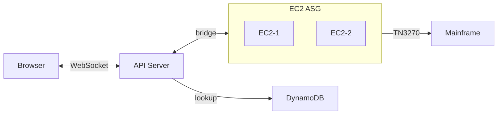

# Migration Plan: Pub/Sub → Direct Bridge (DynamoDB Only)

Migrate from Valkey Pub/Sub to **direct WebSocket bridging**. No Redis — using DynamoDB for session registry.

---

## Target Architecture

```
CloudFront
   ↓
ALB (WebSocket enabled)
   └─ API Server (REST + WebSocket bridge)
              ↓
       EC2 Auto Scaling Group
       (Gateway instances, multi-session)
              ↓
        TN3270 → Mainframe

DynamoDB → session registry + user data
```



---

## Phase 1: Infrastructure

- [ ] EC2 Launch Template for gateway AMI
- [ ] Auto Scaling Group
- [ ] Enable DynamoDB TTL on table

---

## Phase 2: API Refactor ✅

- [x] Add `bridge.ts` for WebSocket bridging
- [x] Add `registry.ts` using DynamoDB (no Redis)
- [x] Refactor `terminal.ts` to use direct bridge

---

## Phase 3: Gateway Refactor

- [ ] Add WebSocket server (port 8080)
- [ ] Handle `/session/:sessionId` connections
- [ ] Remove Valkey subscriber

---

## Phase 4: Cleanup

- [ ] Remove Valkey client from API
- [ ] Remove Valkey from docker-compose
- [ ] Test full flow

---

## Success Criteria

- [ ] Direct WebSocket bridge working
- [ ] Session registry in DynamoDB
- [ ] No Redis/Valkey required
- [ ] 500 concurrent sessions tested
